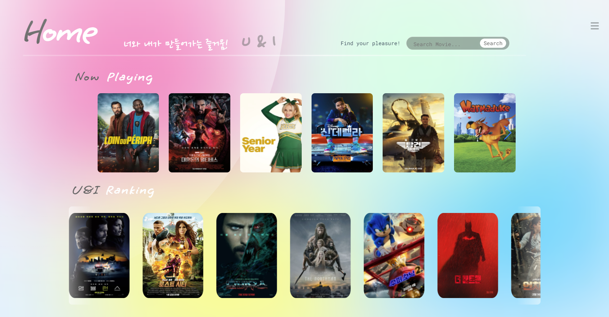
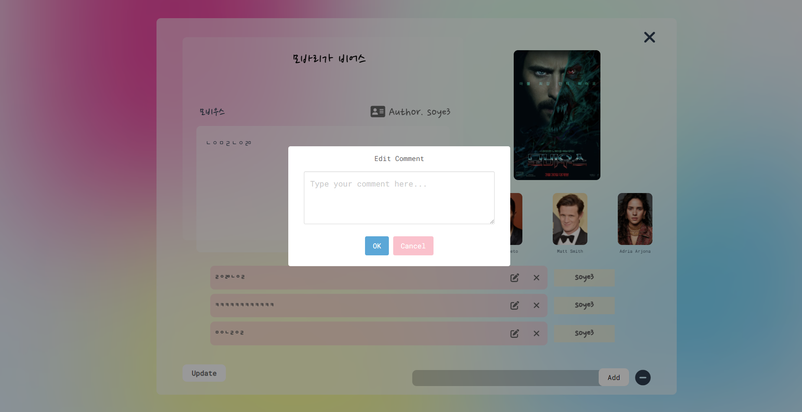

# FINAL-PJT

* 시연 영상 url : https://www.youtube.com/watch?v=zdimkowqAas

## 프로젝트 컨셉

#### 너와 내가 만들어가는 즐거움 I & U

* 컨셉
  * 내가 한 추천이 다른 사람에게도 도움이 될 수 있을 까? 라는 부분에서 출발

  * 유저 위주의 추천 알고리즘을 통해 오직 너를 위한! 이라는 문구에 맞게 영화를 추천 해줌

  * 다양한 추천 사이트를 보았지만 무수히 많은 정보들 때문에 오히려 더 결정하기 어려워짐 > 필요한 기능들로 한 화면에 채우기 위해 노력

  * 한 화면에 필요한 기능들로만 넣어서 사용자들에게 보다 편한 경험을 제공

  * 영화 추천을 유저가 작성한 리뷰 게시글, 유저가 투표한 영화 좋아요 및 다른 유저의 좋아요를 통해서 자신의 행동이 다른 사람에게도 긍정적인 영향을 줄 수 있다는 점을 어필하면서 참여를 독려하려함

  * 딱딱한 웹사이트가 아닌 다양한 애니메이션으로 사용자에게 영화 추천 뿐만 아니라 좀 더 다양한 즐거움을 주기 위함

  * 유저 기반의 추천 알고리즘을 통해 나만의 추천을 얻을 수 있는 사이트, 같이 커뮤니티를 이용하며 함께 만들어가는 사이트를 컨셉으로 잡음

  * 데스크탑 전용 뷰 포인트로 만들었으며 부분적인 컴포넌트들로 반응형을 구현하려 했으나 시간 부족

  * Vue와 Django를 이용한  클라이언트 사이드 렌더링 구현

    

* Tools

  

## 1. 팀원 정보및 업무 분담 내역

- **유광석** (Front: 100%, 조장)

  * Front-End

  * AJAX 요청을 통한 동적 웹사이트 구현

  * 컴포넌트 구조화 및 store 설계

  * Vue.js 를 통한 구현 

  * 대부분 순수 CSS를 이용해서 만든 웹페이지 구현

  * 웹페이지 컨셉 및 디자인 설계

  * UX를 고려한 추가 기능 구현 (css를 활용한 애니메이션, 인터페이스 등)

    

* **소정현** (Back: 100%)

  * Back-End
  * Python 함수를 이용해 TMDB 데이터를 DB에 저장
  
  * 머신 러닝을 이용한 추천 프로그램 
  
  * Content Based Recommendation
  * Collaborative Filtering
  * 기본 기능 구현
  
  * movies app 기본 기능 구현
  * community app 기본 기능 구현
  * accounts app 기본 기능 구현
  * 추가 기능 구현
  
  * search 기능 구현
  * profile 기능 구현
  * 장르별 영화 필터 구현

## 2. 목표 서비스 구현 및 실제 구현 정도

* 챌린지 구현 ( 하단 프로젝트 구현 설명 참조 )

  * 성공

    * intro 구현

    * 장르 필터를 통한 추천 페이지 구현

    * 유저 좋아요를 기반으로한 추천 알고리즘 구현

    * 영화 장르를 기반으로한 추천 알고리즘 구현

    * 검색 필터 기능 구현

    * 유저 경험을 높이기 위해 CSS와 JS를 통한 다양한 기능 구현

    * 부트스트랩을 사용하지 않고 웹페이지 구성 

      

  * 실패

    * FEED Notification 기능 구현

    * 소셜 로그인 서비스

    * 자동완성 알고리즘

    * 배우 좋아요를 통한 영화 추천 알고리즘

    * 프로필 수정 기능  

      

## 3. 프로젝트 설계

* ERD

  

* WIRE FRAME

  

  

  

* 일정 관리 (trello 사용)

  

* 소통
  * 디스코드, 슬랙, 카카오톡

## 4. 프로젝트 구현

#### Login/Signup (필수 기능)

#### HOME (필수 기능)

* Now playing 

  * 현재 상영중인 영화를 전시

  * Swiper를 이용해서 슬라이드가 가능하며 로테이션도 가능하게 함

  * 마우스 호버시 영화의 디테일을 표시

  * 각 영화의 디테일을 클릭할 시 영화 디테일 페이지로 이동

    

* U&I Ranking

  * 사이트 내 인기순으로 영화를 나열

  * 쇼케이스 느낌을 주기 위해 자동으로 왼쪽으로 움직이며 진행 됨

  * 마우스 호버시 포스터는 블러처리 되며 영화 디테일이 표시 된다.

  * 각 영화의 디테일을 클릭할 시 영화 디테일 페이지로 이동

    

#### GENRE (필수 기능)

* DB 영화 정보를 영화 장르를 필터로 해서 추천해줌

  

#### RECOMMENDATION (추가 기능)

* 협업 필터링 (Collarborative Filtering)

  * 협업 필터링은 사용자와 비슷한 성향의 사용자들이 기존에 좋아했던 항목을 추천

  * 많은 사용자들로부터 얻은 정보를 통해 추천을 하여 만족스러운 결과를 도출

  * 좋아요한 영화를 고르면 위의 알고리즘을 바탕으로 영화를 추천하는 기능

    

* 콘텐츠 기반 추천 ( Content Based Recommend)

  * 콘텐츠 기반 필터링은 항목 자체를 분석해 추천

  * 유사성을 검사하기 위해 코사인 유사도를 통해 검사한 후 유사도가 높은 순으로 추천

  * 협업 필터링의 문제점인 시작 데이터 부족을 방지하기 위해 콘텐츠 기반 추천 진행

  * 랜덤으로 영화를 8개 보여 준 뒤 고른 영화를 바탕으로 추천

    

​	

#### 영화 상세페이지 (필수 기능)

* 영화 포스터를 클릭할시 이동하는 사이트

* 영화 정보와 pv가 포함되어있음

* 하단 부에는 이 영화에 대한 리뷰 게시글과 좋아요 버튼이 출력되게함

* 클릭시 좋아요와 게시글 상세페이지로 이동

  

#### 커뮤니티 페이지 (필수 기능)

* 좋아요한 영화를 골라서 게시글을 작성할 수 있으며 커뮤니티에서는 최신순으로 나열 됨
* 각각 게시글에서는 좋아요가 가능하며 코멘트의 입력, 수정, 삭제가 가증
* 상세 페이지에서는 작성자가 본인일 시에 게시글 수정과 삭제가 가능하게 함
* 댓글 부분은 토글 형식으로 온 오프 가능
* 게시글 상세 페이지에서는 작성자의 프로필페이지, 영화디테일 페이지로 이동 가능함

#### 프로필 페이지 (추가 기능)

* 해당 유저가 좋아요한 영화, 작성한 게시글, 좋아요한 게시글의 숫자를 상단 부에 표시
* 하단 부에 이미지를 호버 할 시  관련 게시글의 링크 출력
* 프로필 이미지를 호버시 흰 배경부분에 상태메시지 등장

#### 검색 페이지 (추가 기능)

* 상단 부의 검색창을 이용해서 검색 가능
* 검색시 모달 형식으로 주변 배경을 어둡게 처리하여 연속적인 느낌이 들게함

#### 인트로 페이지 (추가 기능)

* 간단한 무구들과 애니메이션을 통해서 인트로 페이지를 구성

* 페이드인과 화면 분할을 통해 화면 전환 애니메이션을 구현

* 어두운 톤에서 밝은 톤으로 바뀌면서 첫 인상부터 밝은 이미지를 주기 위함

  

## 5. 느낀점

#### 유광석

* 지금까지의 프로젝트를 통틀어서 합친 듯한 느낌의 프로젝트여서 기대보다는 걱정이 많이 앞섰습니다.
* 페어분이 백엔드를 담당하신다고 하셔서 남은 프론트를 담당하게 되었는데 프로젝트를 진행하면서 프론트 부분에 흥미가 생겼습니다.
* Vue와 JS를 단기간에 배우고 실제로 적용을 하려니 처음부터 막막했었는데 이제까지 쌓아왔던 프로젝트와 유튜브 라이브, 웹엑스시간에 열심히 참여해서 만들어 놓았던 수업자료들이 큰 도움이 되었습니다.
* 항상 막히는 부분이 있으면 무엇을 놓치고 있는지 부터 생각하게 되었고 차근차근 처음부터 되짚어나가면서 해결해 나아갔습니다.
* 이번엔 부트스트랩을 사용하지않고 순수 CSS로만 만들어 보려는 챌린지를 했었습니다.
* 특히 이번 프로젝트를 통해서 CSS로 만들 수 있는 다양한 기능을 공부하고 싶어졌습니다. 웹 페이지 꾸미기 용이라고만 생각했었는데 실제로 자료들을 찾아보면서 다양한 사람들이 기상천외한 작품들을 만들어 갔고 하나의 예술 작품과 같은 느낌을 받았습니다.
* 하루에 2~3시간 씩 자면서 CSS를 공부하고 응용하며 시간 가는 줄 모르고 재미있게 즐겼던 프로젝트 였던 것 같습니다.
* 역활을 나눠서 진행해보았는데 서로 그 분야에 대해 깊게 알아간 것 같고 흥미가 생겨서 추후 진로 결정에도 도움이 될 것 같습니다.

#### 소정현

* 지금까지 진행 했던 모든 프로젝트를 관통하는 프로젝트라서 기대가 많이 되었습니다.
* Front에 자신이 없었는데 페어 분이 Front를 담당하며 서로 역할을 분담해서 진행했습니다.
* 백엔드에서 추천 알고리즘을 구현할 때 구현 자체는 어렵지 않았으나 DB를 통해 만들어야하기 때문에 많은 어려움을 겪었으나 공식 문서와 구글링을 통해서 극복해 나갈 수 있었습니다.
* 지금까지 해왔던 프로젝트 중에 가장 재밌었던 프로젝트 였고 예전 부터 딥러닝, 머신러닝을 공부하면서 이걸 어떻게 적용 시키는지 궁금 했었는데 이번 프로젝트를 통해 추천 알고리즘에 적용하고 직접 DB를 다루면서 어떤 식으로 작동하는지 알 수 있어서 좋았습니다.
* 이번 프로젝트를 계기로 백엔드 뿐만 아니라 부족하다고 생각한 프론트부분도 공부하면서 더욱 발전해 나가고 싶습니다.

